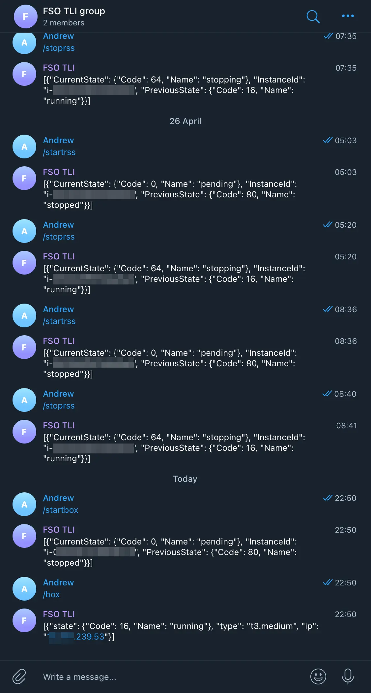

# Problem
EC2 instances are very handy for personal computing needs but they get a bit
expensive just sitting there idling. For most tasks I find that I only need the
instance up for a few minutes or hours anyway. Typical examples for me are:

- Check my [TT-RSS](https://tt-rss.org/) feed
- Use [Wireguard](https://www.wireguard.com/) VPN server to log into [Home
  Assistant](https://www.home-assistant.io/) when I'm not at home.
- Use my remote workstation machine (a.k.a "box") for some work if I'm currently
  running into local compute or bandwidth constraints, or running tools not
  supported on the M1 architecture.

But logging into the AWS console or app every time just to start and stop the
instance is annoying. I wanted a convenient yet still secure way to do this. 

# Solution
Key insight:
- Humans integrate easily with chat (e.g. Telegram)
- Telegram integrates easily with AWS Lambda with zero uptime cost.
- AWS Lambda makes it easy and safe to control other AWS resources using
  [boto3](https://boto3.amazonaws.com/v1/documentation/api/latest/index.html)
  combined with fine-grained IAM policies.

This is approach is broadly referred to as "ChatOps". Specifically my solution
is to use a Telegram bot hosted using AWS Lambda as a cheap, convenient and safe
way to manage and query this infrastructure. I call it "TLI" for "**T**elegram
**L**ine **I**nterface". The name is currently way more ambitious than the
application since it only supports a few simple prompts specific only to me. But
I use it every day so that has to count for something.



# Getting started
Install `serverless` cli
```bash 
npm install -g serverless
````

Use the env var template to populate your details
```bash 
cp example.env .env 
```

Restore dependencies
```bash 
python3 -m pip install -r requirements.txt -t vendored
```

Deploy
```bash 
# Set your AWS env vars AWS_PROFILE, AWS_REGION etc
serverless deploy
```

# Creating a new Telegram bot
- Go to BotFather and send `/newbot`
- Choose a name (e.g `FSO TLI`) and username (e.g. `fso_tli_bot`) for your bot
- Copy the `example.config.json` file add the key and add the bot key
- Create a new telegram group and add the bot there
- Promote bot as administrator to group. If admin, a bot can see messages *with* `/setprivacy` enabled which is the default 
- Disable the bot from joining other groups on BotFather `/setjoingroups`
- Add menu items to the bot
- Restore the dependencies

Use the `registerWebhook.sh` script to link the Bot to the lambda.

# References
https://hackernoon.com/serverless-telegram-bot-on-aws-lambda-851204d4236c
https://github.com/Andrii-D/serverless-telegram-bot?ref=hackernoon.com
https://github.com/python-telegram-bot/python-telegram-bot/wiki/Extensions-%E2%80%93-Your-first-Bot
https://sarafian.github.io/low-code/2020/03/24/create-private-telegram-chatbot.html
https://stackoverflow.com/questions/45889405/how-to-read-messages-from-telegram-group-with-bot
